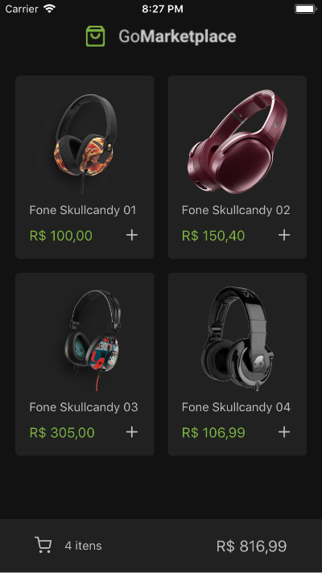
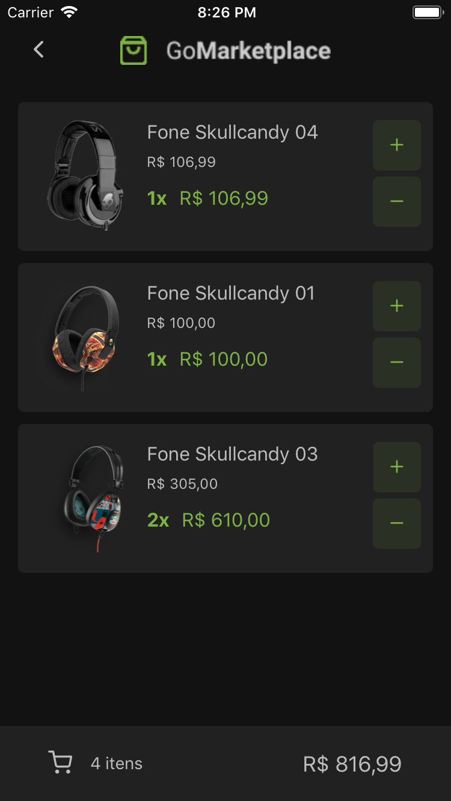

# GoMarketplace

Nesse desafio, desenvolvi uma nova aplicação, a GoMarketplace. Dessa vez pratiquei
o que aprendi até agora no React Native junto com o TypeScript na Bootcamp da Rocketseat, 
utilizando rotas, Async Storage e a Context API. 

:sunglasses: &nbsp;&nbsp Fiz algumas alterações no tema para inserir um pouco da minha identidade a essa aplicação 
e esse foi o resultado: 

 

